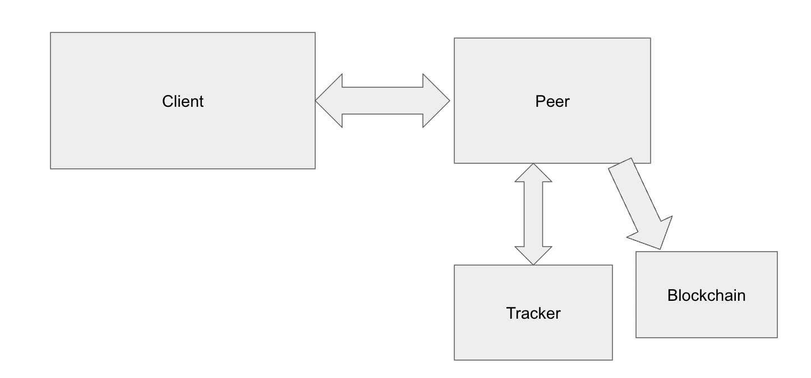

## PROJECT IDEAS:

- What if we lived in a world without a centralized government? And all decisions were voted on by the population. The results of these votes would be extremely sensitive, so we can’t trust any individual to store it in its entirety. We propose a protocol to support Blockchain Voting Ledger for Direct Democracy

<b>Note: We have not implemented Forking support in our project</b>

 **File Structure**:
   1. app.py
   2. blockchain.py
   3. peer.py
   4. tracker.py

## Architecture Design:

Dataflow: 
         

Our client application (used Flask) deals with retrieving the client's voting infomation. The voting information is sent to a available peer on the network where the peer will attempt to create a block and validate the block's itegrity and client's sent data. Based on the validity of the block, the block will be added to the blockchain and broadcast to the other peers that are connected to the network. The available peer information is collected from a tracker which keeps track of the alive peers in the network. a peer communicates with a tracker in every 10s. 

Components:
   1. Blockchain
   2. Peer
   3. Application
    

## Components Description

1. **Blockchain Design**:
    - Divided into two parts: Blockchain class and Block class
        - **Blockchain class**: Deals with adding a valid block to the chain
            - Create a dummy block and add it to the blockchain, named as the genesis block.
            - Perform mining of a block so that the block has a valid hash.
            - Implement peer-to-peer consensus rules.
            - Validate client vote information by ensuring that any two same voterIDs do not exist in the same blockchain. If so, both peers and client-communicated peers will reject the block.
            - Maintain the longest chain once a peer joins the network in order to synchronize with the network.
        - **Block class**: This class is responsible for initiating a block which contains headers such as timestamp, nonce, transaction, previous_hash, hash_data. This class is responsible for creating its own hash based on the headers. 
    

2. **Peer Design**
    - Peer is divided into three parts:
        - **p2pserver()**
        - **p2pclient()**
        - **handleTracker()**
    - Each of the parts runs on different threads. 
    - **p2pserver()**:
        - Responsible for handling incoming requests from other peers and clients.
        - Requests include: request for getting blockchain when a peer joins the network, validating a new block when a peer broadcasts to other peers so that other peers check the validity of the newly incoming block and add it to their own chain; getting results of the blockchain and sending them to the client; and finally, a voting transaction requests from clients.
        - Peer server calls blockchain functions to transform a transaction to a block by adding the transaction to the unverified transaction array and calling the miner function to mine the block and add it to the chain if the block is valid. If the block is not valid, the server sends a 400 status to the client.
        - Peer server calls blockchain function when a peer wants a new blockchain upon joining the network. The chain is sent as a dictionary to the peer.
        - Peer server calls blockchain function when a peer broadcasts its newly added block to the peers. The block is validated, and the status is sent to the peer.
     
     - **p2pclient()**:
        - New peer situation:
            - Request for the blockchain list from all its peers (get from tracker).
            - If there is only one peer, the peer will wait for a couple of seconds to have other peers.
            - If there are other peers, the request for "needBlockchain" will be broadcasted to the other peers. Upon receiving their chains, the longest chain will be determined and updated as its own chain.

    - **handleTracker()**:
        - This thread maintains connections with the tracker to receive updates about the alive trackers every 10 seconds.
3. **App Design**
 - we have designed app using flask and html. we have set up the interface such that the user can cast a vote and send the vote info to the peer (randomly choosen by reading localhost.txt file). app.py communicates with a peer using socket. The client can also send a request to the peer to get the result of the vote

            
